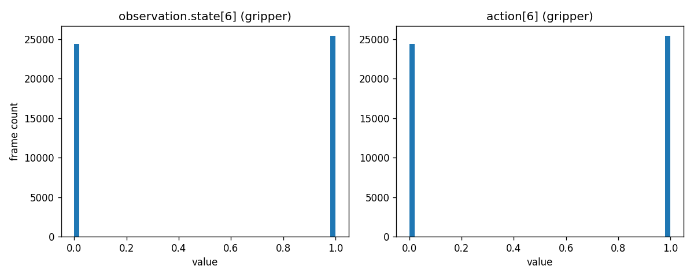
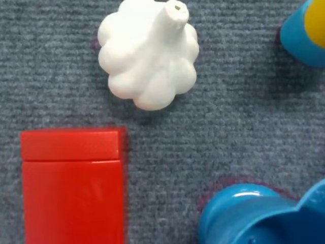
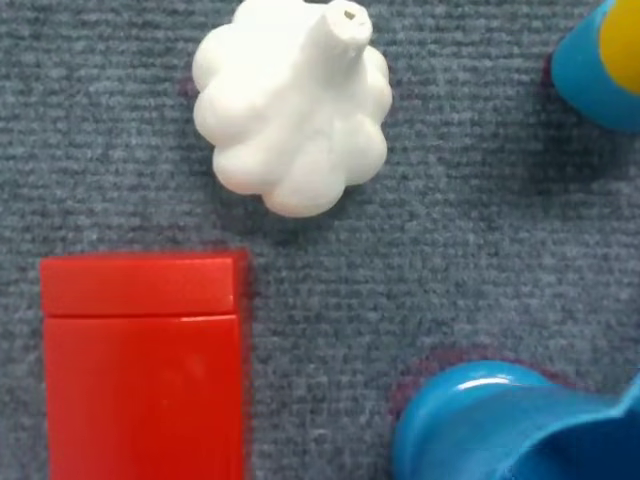
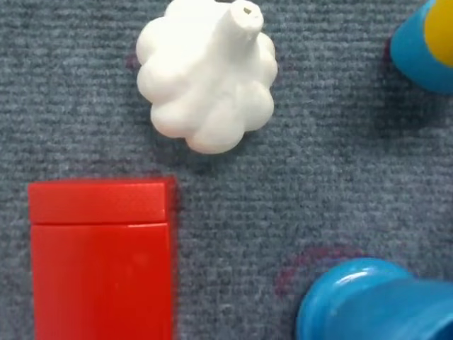
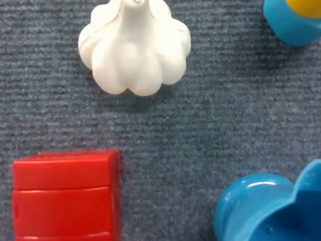
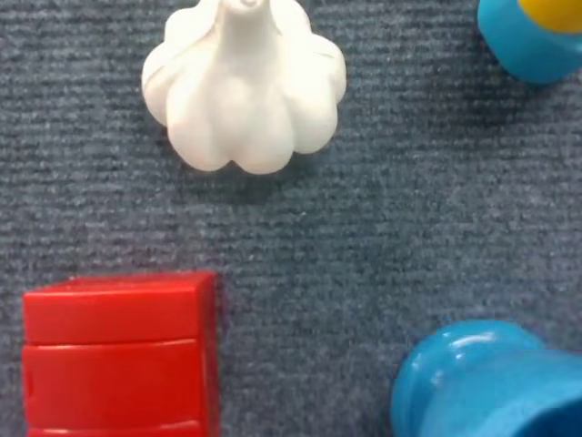
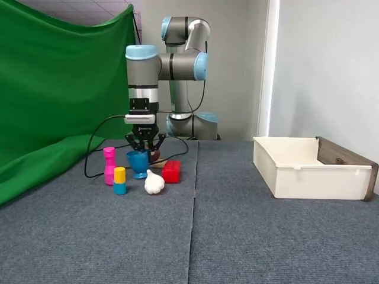
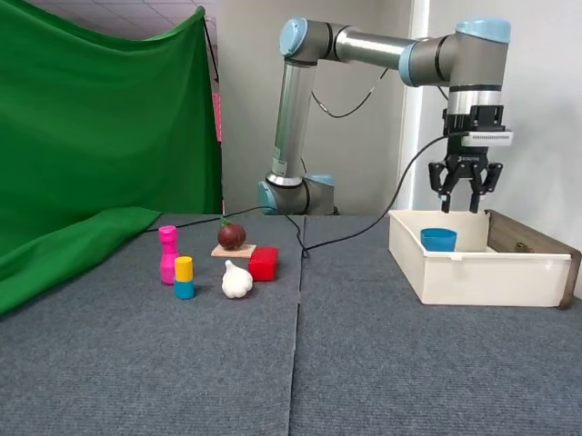
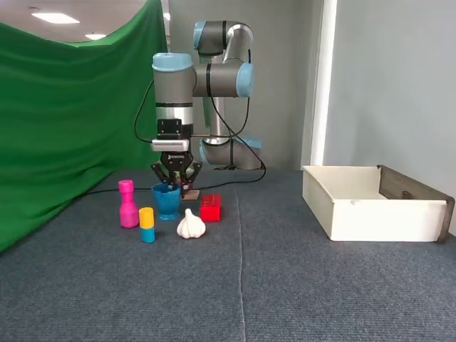
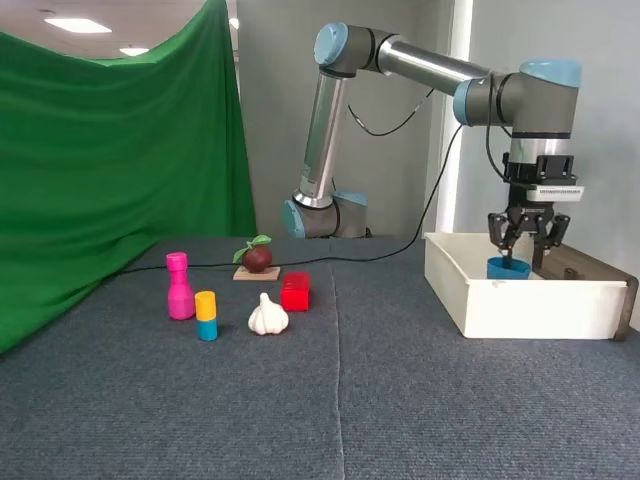

# Raw Dataset Inspection Report

## 1. Dataset overview

- Source: `khanhnd61/ur10e-cup` (HuggingFace, LeRobot codebase v3.0)
- Dataset root: `ur10e\data\v30`
- Episodes: 81
- Total frames: 49779
- FPS: 20

## 2. Episode-to-video map

Actual columns found in `meta/episodes/chunk-000/file-000.parquet`:

- `episode_index`
- `tasks`
- `length`
- `data/chunk_index`
- `data/file_index`
- `dataset_from_index`
- `dataset_to_index`
- `videos/observation.images.side/chunk_index`
- `videos/observation.images.side/file_index`
- `videos/observation.images.side/from_timestamp`
- `videos/observation.images.side/to_timestamp`
- `videos/observation.images.wrist/chunk_index`
- `videos/observation.images.wrist/file_index`
- `videos/observation.images.wrist/from_timestamp`
- `videos/observation.images.wrist/to_timestamp`
- `stats/observation.state/min`
- `stats/observation.state/max`
- `stats/observation.state/mean`
- `stats/observation.state/std`
- `stats/observation.state/count`
- `stats/observation.state/q01`
- `stats/observation.state/q10`
- `stats/observation.state/q50`
- `stats/observation.state/q90`
- `stats/observation.state/q99`
- `stats/action/min`
- `stats/action/max`
- `stats/action/mean`
- `stats/action/std`
- `stats/action/count`
- `stats/action/q01`
- `stats/action/q10`
- `stats/action/q50`
- `stats/action/q90`
- `stats/action/q99`
- `stats/timestamp/min`
- `stats/timestamp/max`
- `stats/timestamp/mean`
- `stats/timestamp/std`
- `stats/timestamp/count`
- `stats/timestamp/q01`
- `stats/timestamp/q10`
- `stats/timestamp/q50`
- `stats/timestamp/q90`
- `stats/timestamp/q99`
- `stats/frame_index/min`
- `stats/frame_index/max`
- `stats/frame_index/mean`
- `stats/frame_index/std`
- `stats/frame_index/count`
- `stats/frame_index/q01`
- `stats/frame_index/q10`
- `stats/frame_index/q50`
- `stats/frame_index/q90`
- `stats/frame_index/q99`
- `stats/episode_index/min`
- `stats/episode_index/max`
- `stats/episode_index/mean`
- `stats/episode_index/std`
- `stats/episode_index/count`
- `stats/episode_index/q01`
- `stats/episode_index/q10`
- `stats/episode_index/q50`
- `stats/episode_index/q90`
- `stats/episode_index/q99`
- `stats/index/min`
- `stats/index/max`
- `stats/index/mean`
- `stats/index/std`
- `stats/index/count`
- `stats/index/q01`
- `stats/index/q10`
- `stats/index/q50`
- `stats/index/q90`
- `stats/index/q99`
- `stats/task_index/min`
- `stats/task_index/max`
- `stats/task_index/mean`
- `stats/task_index/std`
- `stats/task_index/count`
- `stats/task_index/q01`
- `stats/task_index/q10`
- `stats/task_index/q50`
- `stats/task_index/q90`
- `stats/task_index/q99`
- `stats/observation.images.side/min`
- `stats/observation.images.side/max`
- `stats/observation.images.side/mean`
- `stats/observation.images.side/std`
- `stats/observation.images.side/count`
- `stats/observation.images.side/q01`
- `stats/observation.images.side/q10`
- `stats/observation.images.side/q50`
- `stats/observation.images.side/q90`
- `stats/observation.images.side/q99`
- `stats/observation.images.wrist/min`
- `stats/observation.images.wrist/max`
- `stats/observation.images.wrist/mean`
- `stats/observation.images.wrist/std`
- `stats/observation.images.wrist/count`
- `stats/observation.images.wrist/q01`
- `stats/observation.images.wrist/q10`
- `stats/observation.images.wrist/q50`
- `stats/observation.images.wrist/q90`
- `stats/observation.images.wrist/q99`
- `meta/episodes/chunk_index`
- `meta/episodes/file_index`

Self-check 1 — sum(length) over all episodes:
- Expected: 49779. Observed: **49779**. PASS

Self-check 2 — |(to_timestamp - from_timestamp) - length/fps| < 0.1s, per episode and camera:
- Max deviation, side camera: 4.6185278e-14 s
- Max deviation, wrist camera: 9.2370556e-14 s
- No episode/camera pair exceeds the threshold. PASS

Self-check 3 — do side and wrist share the same file boundaries?
- side: 4 distinct video files (file_index -> episode range: 0: 0-22, 1: 23-46, 2: 47-69, 3: 70-80)
- wrist: 3 distinct video files (file_index -> episode range: 0: 0-37, 1: 38-78, 2: 79-80)
- **Conclusion: side and wrist do NOT necessarily share the same file boundaries — NO, they differ.**

Full per-episode mapping: [`episode_video_map.csv`](episode_video_map.csv).

## 3. action[t] == state[t+1] identity

Residual defined as `residual[t] = action[t] - state[t+1]`, computed within each episode (t from 0 to length-2), over 49698 rows total (49779 frames - 81 episode boundaries).

| group | max\|residual\| | mean\|residual\| | p99\|residual\| | n > 1e-6 | n > 1e-3 | n total |
|---|---|---|---|---|---|---|
| 6 joints | 0 | 0 | 0 | 0 | 0 | 298188 |
| gripper | 0 | 0 | 0 | 0 | 0 | 49698 |

Per-joint signed mean and std of the residual (systematic bias check):

| joint | signed mean | signed std |
|---|---|---|
| shoulder_pan | 0 | 0 |
| shoulder_lift | 0 | 0 |
| elbow | 0 | 0 |
| wrist_1 | 0 | 0 |
| wrist_2 | 0 | 0 |
| wrist_3 | 0 | 0 |

**Conclusion:** **Identity holds exactly** (`max|residual| < 1e-6`). `action[t]` is a one-frame-shifted copy of `state[t+1]`.

Final frame of each episode (no `state[t+1]` exists there):
- mean\|action[last] - state[last]\| per dim (joints): 0, gripper: 0
- max\|action[last] - state[last]\| per dim (joints): 0, gripper: 0
- mean\|action[last] - action[second-to-last]\| per dim (joints): 0, gripper: 0
- Both hypotheses tie exactly (mean\|diff\| = 0 for both): the final-frame action is consistent with **both** holding position and repeating the last command, because the identity `action[t] == state[t+1]` holds exactly at every other frame, so `state[last]` and `action[second-to-last]` are themselves equal here.

## 4. R10 gripper polarity

### Distinct values (state, gripper channel, index 6)

| value (rounded to 4dp) | frequency |
|---|---|
| 1.0 | 25411 |
| 0.0 | 24368 |

### Distinct values (action, gripper channel, index 6)

| value (rounded to 4dp) | frequency |
|---|---|
| 1.0 | 25411 |
| 0.0 | 24368 |

Total transitions (state[t,6] != state[t-1,6], within episode): **162**
Episodes containing at least one transition: 81 / 81

Frames extracted from the WRIST camera around the first transition of 2 episodes (chosen at the low and high ends of the episode index range): episodes [0, 80].

- `figures/r10_ep000_frame000363_offsetm0.5s_g1to0.png`
  
- `figures/r10_ep000_frame000363_offsetp0.0s_g1to0.png`
  
- `figures/r10_ep000_frame000363_offsetp0.5s_g1to0.png`
  
- `figures/r10_ep080_frame049432_offsetm0.5s_g1to0.png`
  
- `figures/r10_ep080_frame049432_offsetp0.0s_g1to0.png`
  
- `figures/r10_ep080_frame049432_offsetp0.5s_g1to0.png`
  

### Supplementary evidence (side camera) -- DEVIATION FROM SPEC 4.3(c)

The 6 wrist-camera frames above were inspected and do not include the gripper mechanism at any of the sampled timestamps -- the wrist camera frames the tabletop/bin area but the two-finger jaw itself is outside its field of view at these poses. This was checked across both chosen episodes, at both the grasp and release transitions, and at a wide range of time offsets (up to +-1s) around each; the framing never includes the fingers. Per section 4.3, an inconclusive result from wrist images should either extract more episodes or report PARTIAL -- both were tried, and the wrist camera remained uninformative. As a deviation from the wrist-only methodology, the SIDE camera (already available from the same episodes, mapped in `episode_video_map.csv`) is used below to reach an actual image-based conclusion instead of leaving the question open. This is a **deviation from spec**, reported in the completion report's DEVIATIONS FROM SPEC section.

- `figures/r10_side_ep000_grasp_before_g1to0.png`
  
- `figures/r10_side_ep000_grasp_after_g1to0.png`
  
- `figures/r10_side_ep000_release_before_g0to1.png`
  
- `figures/r10_side_ep000_release_after_g0to1.png`
  
- `figures/r10_side_ep080_grasp_before_g1to0.png`
  
- `figures/r10_side_ep080_grasp_after_g1to0.png`
  
- `figures/r10_side_ep080_release_before_g0to1.png`
  
- `figures/r10_side_ep080_release_after_g0to1.png`
  

**Conclusion (from visual inspection of the images above): The wrist camera does not include the gripper mechanism in its field of view at any of the sampled timestamps (see the 'Supplementary evidence' subsection below) -- this is a deviation from the wrist-only methodology in TIP-003 section 4.3(c), taken because the wrist frames alone were inconclusive. The conclusion below is instead drawn from SIDE camera frames at the same transitions, in episodes 0 and 80: with the gripper value at 0, the jaw is visibly closed around the cup, holding it above the bin; immediately after the value flips to 1, the jaw is visibly open and the cup has dropped into the bin. This pattern is consistent and independently reproduced in both episodes.**

Gripper value **1 = open**, **0 = closed**.
- This **matches** the dataset card (`1 = open`).
- This **contradicts** the `processor_vla_jepa.py` docstring (`0 = open, 1 = close`).
- **The next pack must flip the gripper channel** (`g_new = 1 - g_old`) only if it follows the author's pipeline convention (`0 = open`); if it follows the dataset card convention, no flip is needed. Since this measurement confirms the dataset card, **no flip is required when downstream code treats `1` as open**.

## 5. R12 outliers

**Interpretation note:** the "healthy DROID" reference ratio of 0.76-0.89 was measured on actions centred near the origin. UR joint angles in absolute form can sit entirely on one side of zero, in which case `q99/max` becomes meaningless (it can exceed 1, go negative, or look artificially close to 1). Therefore:
- For the **delta** representation (`action - state`, centred near 0): `ratio` is the primary indicator; `ratio < 0.3` flags an outlier.
- For the **absolute** representation: `ratio` is not trustworthy; `gap` is the primary indicator; `gap > ~0.1` flags a tail that will stretch min_max normalization.

### Absolute (action as stored)

| dim | min | q01 | q50 | mean | std | q99 | max | ratio_hi | ratio_lo | gap_hi | gap_lo |
|---|---|---|---|---|---|---|---|---|---|---|---|
| shoulder_pan | -1.6301 | -1.628 | -1.5706 | -1.4059162 | 0.22784314 | -1.0459 | -1.036 | 1.009556 | 0.99871174 | 0.017007341 | 0.0036076116 |
| shoulder_lift | -1.9923 | -1.9738219 | -1.8758 | -1.8609859 | 0.088139333 | -1.5707999 | -1.5707999 | 1 | 0.99072525 | 0 | 0.045848827 |
| elbow | -1.6848 | -1.651722 | -1.4861 | -1.4802629 | 0.089774117 | -1.233678 | -1.2006 | 1.0275512 | 0.98036681 | 0.079125657 | 0.079125657 |
| wrist_1 | -1.6242 | -1.6138999 | -1.3767999 | -1.3721334 | 0.12920263 | -1.1669 | -1.1483999 | 1.0161094 | 0.99365839 | 0.041387234 | 0.0230426 |
| wrist_2 | 1.5702 | 1.5704 | 1.5709 | 1.5709347 | 0.00027381128 | 1.5714999 | 1.5716 | 0.99993636 | 1.0001274 | 0.090928796 | 0.18185759 |
| wrist_3 | -3.2003 | -3.1973 | -3.1408999 | -2.9756112 | 0.22803061 | -2.6149001 | -2.605 | 1.0038004 | 0.99906258 | 0.016998791 | 0.0051511363 |
| gripper | 0 | 0 | 1 | 0.51047629 | 0.49989024 | 1 | 1 | 1 | nan | 0 | 0 |

- **wrist_2 flagged.** Extreme-max frame: episode_index=16, frame_index=469, value=1.5716. Extreme-min frame: episode_index=2, frame_index=281, value=1.5702. Proposal: exclude or clip these specific frames before fitting min_max stats (not applied by this read-only pack).

### Delta (action[t] - state[t])

| dim | min | q01 | q50 | mean | std | q99 | max | ratio_hi | ratio_lo | gap_hi | gap_lo |
|---|---|---|---|---|---|---|---|---|---|---|---|
| shoulder_pan | -0.0059999228 | -0.0027999878 | 0 | 0.00081837515 | 0.001700383 | 0.0056999922 | 0.0062000751 | 0.91934243 | 0.46667064 | 0.058833429 | 0.37646382 |
| shoulder_lift | -0.0086001158 | -0.0057998896 | 0 | -0.00055019994 | 0.0016825035 | 0.0019000769 | 0.0030999184 | 0.61294416 | 0.67439668 | 0.15582425 | 0.36366733 |
| elbow | -0.0091000795 | -0.0061000586 | 0 | 0.00020816202 | 0.0029872514 | 0.0072000027 | 0.011100054 | 0.64864575 | 0.67033025 | 0.29323558 | 0.22556445 |
| wrist_1 | -0.0089000463 | -0.0058000088 | 0 | 0.00033694721 | 0.0029332421 | 0.0082000494 | 0.0091999769 | 0.89131195 | 0.65168299 | 0.071423098 | 0.22143034 |
| wrist_2 | -0.00020003319 | -0.00010001659 | 0 | 9.8246187e-07 | 3.8520313e-05 | 0.00010001659 | 0.00020003319 | 0.5 | 0.5 | 0.5 | 0.5 |
| wrist_3 | -0.0059001446 | -0.0027999878 | 0 | 0.00082026143 | 0.0017007345 | 0.005699873 | 0.0062000751 | 0.91932321 | 0.47456257 | 0.058848279 | 0.3647303 |
| gripper | -1 | 0 | 0 | 0 | 0.057047211 | 0 | 1 | 0 | 0 | nan | nan |

- **gripper flagged.** Extreme-max frame: episode_index=0, frame_index=720, value=1. Extreme-min frame: episode_index=0, frame_index=362, value=-1. Proposal: exclude or clip these specific frames before fitting min_max stats (not applied by this read-only pack).

## 6. R9 angle wrap

`d[t] = action[t, 0:6] - state[t, 0:6]`, scanned over all 49779 frames (no episode grouping needed since this compares same-index rows).

Count of `|d| > pi`: **0**

max\|d\| per joint (reported regardless of whether the count above is zero):

| joint | max\|d\| (rad) |
|---|---|
| shoulder_pan | 0.0062000751 |
| shoulder_lift | 0.0086001158 |
| elbow | 0.011100054 |
| wrist_1 | 0.0091999769 |
| wrist_2 | 0.00020003319 |
| wrist_3 | 0.0062000751 |

Physical sanity check: at 20 fps (50 ms per frame), a real UR10e joint cannot physically rotate pi radians in one frame. Any `|d| > pi` observed above is almost certainly angle wrap-around or a logging artifact, not real motion.

## 7. R8 copy baselines

### Baseline A — copy state (`action[t] ~ state[t]`, absolute representation)

- MSE, 6 joints: **4.6576392e-06**
- MSE, gripper: **0.0032543843**

### Baseline B — copy previous action (`action_hat[t] = action[t-1]`)

- Frames skipped at episode boundaries: **81** (must equal 81: PASS)
- MSE (absolute representation), 6 joints: **4.6652303e-06**
- MSE (absolute representation), gripper: **0.0032596886**
- MSE (delta representation `d = action - state`), 6 joints: **5.8417214e-07**
- MSE (delta representation `d = action - state`), gripper: **0.0065193772**

### Variance ratio: `var(action_absolute) / var(action - state)`

| dim | var(absolute) | var(delta) | ratio |
|---|---|---|---|
| shoulder_pan | 0.051912136 | 2.891757e-06 | 17951.764 |
| shoulder_lift | 0.0077685174 | 2.8309105e-06 | 2744.1763 |
| elbow | 0.0080595259 | 8.9222003e-06 | 903.31146 |
| wrist_1 | 0.016693033 | 8.6045375e-06 | 1940.0269 |
| wrist_2 | 2.7056629e-07 | 1.4834922e-09 | 182.3847 |
| wrist_3 | 0.051998422 | 2.8922193e-06 | 17978.727 |
| gripper | 0.24989769 | 0.0032543843 | 76.78801 |

## 8. R15 dead channel wrist_2

`observation.state`, all 7 dimensions, over the whole dataset:

| dim | min | max | span | mean | std |
|---|---|---|---|---|---|
| shoulder_pan | -1.6301 | -1.036 | 0.5941 | -1.4067346 | 0.22752984 |
| shoulder_lift | -1.9923 | -1.5707999 | 0.42150009 | -1.8604357 | 0.088885613 |
| elbow | -1.6848 | -1.2006 | 0.4842 | -1.4804711 | 0.089815766 |
| wrist_1 | -1.6242 | -1.1483999 | 0.47580004 | -1.3724704 | 0.12944146 |
| wrist_2 | 1.5702 | 1.5716 | 0.0013999939 | 1.5709337 | 0.00027319617 |
| wrist_3 | -3.2003 | -2.605 | 0.59529996 | -2.9764314 | 0.22771874 |
| gripper | 0 | 1 | 1 | 0.51047629 | 0.49989024 |

- wrist_2 span vs Blueprint reference (~0.0011 rad): observed 0.0013999939 rad — CONFIRMED
- wrist_2 std vs Blueprint reference (~3e-4): observed 0.00027319617 — CONFIRMED
- wrist_2 mean vs pi/2 (1.5707963): observed 1.5709337
- wrist_2 span is **714.28883x smaller** than the largest-span dimension (gripper, span=1 rad).

No change to `action_dim` or to any `transform()` is proposed here, per the Homeowner's decision to leave this channel as-is. This section only records the numbers for the final project report.

## 9. Findings and recommendations

Ordered by severity, for the next (transformation) pack to act on:

- HIGH — delta-representation outlier on gripper (ratio_hi=0, ratio_lo=0); see R12 section for the offending frames.
- MEDIUM — absolute-representation tail on wrist_2 (gap_hi=0.090928796, gap_lo=0.18185759); see R12 section for the offending frames.
- INFO — wrist_2 is a near-dead channel (see R15); Homeowner decision is to leave it as-is.
