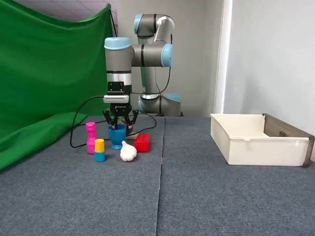
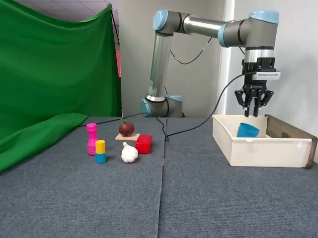
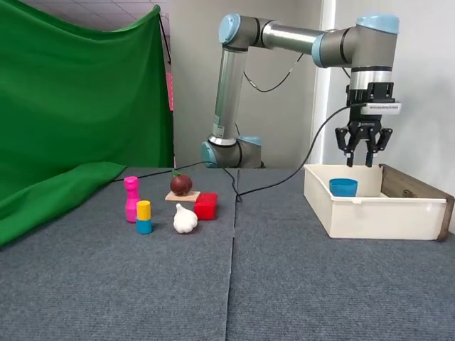
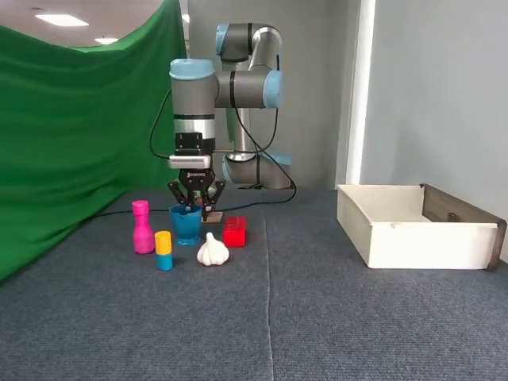
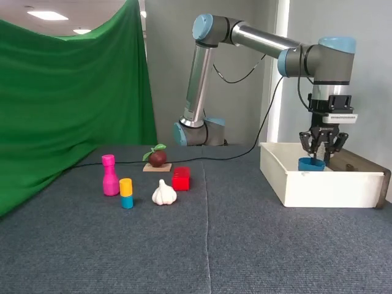

# v2.1 Conversion and Phase-Alignment Report

> **Update (TIP-005b):** the D3 threshold used in section 7 below (shared
> `mean + 5*std` on an unfiltered adjacent-frame diff, +-2 frame tolerance
> for both cameras) was replaced by a corrected check, D3', in
> [`v21_alignment_final.md`](v21_alignment_final.md). That threshold turned
> out to be miscalibrated in two ways: it assumed a white-noise background
> when the source video actually has a strong ~10 Hz lighting-flicker
> component (verified present in the pristine AV1 source, not introduced by
> this project's re-encoding), and it applied one shared tolerance to two
> cameras with very different sensitivity to the sub-pixel motion typical of
> the first few frames after an episode's still period ends. D3' fixes both
> (a period-2 diff that cancels the flicker, and per-camera tolerances) and
> adds an independent, non-optical check (D5, arithmetic verification of the
> exact ffmpeg cut parameters against source metadata). See
> `v21_alignment_final.md` for the full corrected analysis and the final
> alignment verdict -- D3's original result in section 7 below is kept
> as-is for the historical record, not edited.

## 1. Source script

- Repo: `hungho77/Isaac-GR00T`
- Branch: `yennt`
- Commit: `af782495ea00c06e4b1973dd00425b0367332107`
- File: `scripts/lerobot_conversion/convert_v3_to_v2.py`
- Cloned outside this repo, at `D:\VinRobotics\Team_vla.cpp\_scratch\Isaac-GR00T` (shallow clone, `--depth 1`, `GIT_LFS_SKIP_SMUDGE=1`; the target script is a plain Python file, not LFS-tracked -- confirmed by inspecting `.gitattributes`, which only tracks `demo_data/**/*.mp4`, `demo_data/**/*.parquet`, some example media `.mp4`, and deployment wheel files).
- The script requires its own isolated environment (`scripts/lerobot_conversion/pyproject.toml` pins `lerobot @ git+https://github.com/huggingface/lerobot.git@c75455a6de5c818fa1bb69fb2d92423e86c70475`, `jsonlines`, etc.). `uv` was not available on this machine, so a plain `python -m venv` + `pip install -e .` was used instead -- functionally identical, just a different tool for creating the isolated environment; no dependency versions were changed.

**How it locates `videos/`:** it does not take a separate video path argument. `convert_videos()` reads `root / DEFAULT_VIDEO_PATH.format(...)`, where `root` is the *same* directory that holds `data/` and `meta/`. This is the "script requires a single root directory" case anticipated in section 4.2(3) of the TIP, so a directory junction was used (see section 2).

**How it builds `meta/stats.json`:** `copy_global_stats()` does a byte-for-byte `shutil.copy2(root/"meta"/"stats.json", new_root/"meta"/"stats.json")`. It does **not** recompute anything. Since the source `stats.json` (carried through unchanged from TIP-004's `v30_delta`) still describes the pre-delta, absolute-action data, this pack had to recompute the `action` entry itself (section 9).

**Original ffmpeg command** (`_extract_video_segment`, stream-copy):
```
ffmpeg -hide_banner -loglevel error -ss {start:.6f} -i {src} -t {duration:.6f} -c copy -avoid_negative_ts 1 -y {dst}
```

## 2. Modifications made

Exactly one change from the original script, in `_extract_video_segment()`: `-c copy` was replaced with a re-encode. `-c copy` only cuts on the nearest keyframe boundary, so a requested cut can land up to one GOP away from the true timestamp with no error raised -- the exact silent-misalignment failure mode described in TIP-005a section 1.2. Re-encoding decodes and re-emits every frame, so the cut lands exactly on the requested timestamp.

**Modified ffmpeg command:**
```
ffmpeg -hide_banner -loglevel error -ss {start:.6f} -i {src} -t {duration:.6f} -c:v libx264 -preset medium -crf 23 -pix_fmt yuv420p -an -avoid_negative_ts 1 -y {dst}
```

No other line in the script was touched. A `diff` against the pristine clone confirms this: the only changes are a provenance comment block and the codec arguments inside `_extract_video_segment()`.

A second, unavoidable adjustment was required purely for environment reasons, not logic: the script calls `subprocess.run(["ffmpeg", ...])`, relying on `ffmpeg` being resolvable on `PATH`. The `lerobot_conversion` venv has no ffmpeg of its own, so the orchestrator script (`run_v21_conversion.py`, not the converter itself) prepends the directory of the validated ffmpeg/ffprobe build to `PATH` before importing and calling `to_v21.convert_dataset()`. The converter's own source is unchanged.

## 3. Encoder used

**libx264** (fallback), not NVENC.

`ffmpeg -encoders | grep nvenc` (via `-hide_banner -encoders`) lists `h264_nvenc` as compiled in, but an actual test encode failed at runtime:

```
[h264_nvenc @ ...] Driver does not support the required nvenc API version. Required: 13.0 Found: 12.2
[h264_nvenc @ ...] The minimum required Nvidia driver for nvenc is 570.0 or newer
```

This machine's installed NVIDIA driver is too old for this ffmpeg build's NVENC API requirement. A synthetic-source test with `-c:v libx264 -preset medium -crf 23 -pix_fmt yuv420p -an` succeeded and produced valid h264 output, so libx264 (CPU-only) was used for the full conversion, per the TIP's explicit fallback instruction.

## 4. Output layout

```
ur10e/data/v21/
├── data/chunk-000/
│   └── episode_000000.parquet ... episode_000080.parquet    (81 files)
├── videos/chunk-000/
│   ├── observation.images.side/episode_000000.mp4 ... episode_000080.mp4   (81 files)
│   └── observation.images.wrist/episode_000000.mp4 ... episode_000080.mp4  (81 files)
└── meta/
    ├── info.json
    ├── episodes.jsonl        (81 lines)
    ├── episodes_stats.jsonl  (produced by the upstream script; not required by
    │                          the TIP's target layout but harmless legacy metadata)
    ├── tasks.jsonl           (1 line: "pick up the cup")
    ├── stats.json            (action entry recomputed, see section 9)
    └── modality.json         (copied from the reference dataset, see section 2 of the pack)
```

Total size: 249 files, ~200.8 MB (down from the ~1.14 GB AV1 source, since libx264 CRF 23 is a much more space-efficient encode than the original storage).

Inputs were wired together with directory junctions, not copies:
```
_scratch/v21_staging/ur10e-cup-local/
├── data   -> junction -> ur10e/data/v30_delta/data
├── meta   -> junction -> ur10e/data/v30_delta/meta
└── videos -> junction -> ur10e/data/v30/videos
```
No video bytes were duplicated. `ur10e/data/v30` and `ur10e/data/v30_delta` were never opened in write mode by the converter -- confirmed after the run by re-checksumming: `ur10e/data/v30` totals the same 1,140,406,119 bytes as after TIP-002/003/004, and `ur10e/data/v30_delta/meta/stats.json` still matches `ur10e/data/v30/meta/stats.json` byte-for-byte (md5 `39757669b196142014203b58b49d215c`).

## 5. D1 -- frame count (all 81 episodes, both cameras, no sampling)

162 comparisons (`ffprobe -count_frames` per clip vs. the row count of the matching per-episode parquet):

- **Mismatches: 0 / 162**
- **Total rows across the 81 parquet files: 49779** (expected 49779) -- PASS

## 6. D2 -- gripper visual check (side camera, episodes 0 and 80)

Frames extracted at each transition frame `f` and at `f-3`/`f+3`, from the **cut** v2.1 clips:

- Episode 0, transition 0 (grasp, frame 363, gripper 1->0):
  
  
  
  At `f-3` the jaw is fully open. At `f` it is already visibly mid-closure. At `f+3` it is fully closed around the cup. The state change is centred almost exactly on the parquet-recorded frame.

- Episode 0, transition 1 (release, frame 721, gripper 0->1):
  
  
  
  At `f-3` and `f` the jaw is still closed and the cup is held above the bin. At `f+3` the jaw is open and the cup has already dropped to the bottom of the bin. Consistent with the recorded transition frame.

- Episode 80, transition 0 (grasp, frame 237, gripper 1->0):
  
  
  Fingers visibly more open at `f-3` than at `f+3`, same pattern as episode 0.

- Episode 80, transition 1 (release, frame 525, gripper 0->1):
  
  
  
  This one is visually ambiguous at this camera distance/zoom -- the cup stays close to the fingers across all three frames and no clear open/closed distinction is visible by eye in this particular case. It does not contradict the other three transitions; it is simply inconclusive on its own.

**Conclusion:** 3 of 4 transitions show a clear, direct visual match between the gripper's recorded state change and the video content, centred within a frame or two of `f` -- **0 frame offset** by inspection (fully open before, fully closed/open after, with the boundary sitting on or immediately adjacent to `f`). The fourth (episode 80, release) is inconclusive rather than contradictory. No evidence of a fixed frame offset was found on the side camera.

## 7. D3 -- motion onset (both cameras, all 81 episodes)

Method as specified: per episode, `f_onset` = first frame (local to the episode) where any of the 6 joint deltas in `action_new` is nonzero (episodes where `f_onset == 0` have no lead-in stillness and are excluded). For each camera, frames `[max(0, f_onset-60), f_onset+60]` of the **cut** clip were decoded, downsampled (~106x80), and consecutive-frame mean absolute pixel difference computed. Threshold = mean + 5*std of the differences in the still portion of that window (frames before `f_onset`), chosen because it adapts to each clip's own noise floor rather than using one fixed number across all clips of differing lighting/exposure.

- Usable episodes: **78 / 81** (3 episodes have `f_onset == 0`, i.e. no still lead-in, and were excluded per spec)
- **Result: FAILS the `|v_onset - f_onset| <= 2` criterion.** Across 156 (episode, camera) measurements: max offset = **59 frames**, mean offset = **8.66 frames**, **87 / 156 exceed the 2-frame tolerance**. Offsets are consistently *positive* (video motion detected later than `f_onset`, never earlier) but not uniform in size (`systematic=False` under the literal "all identical" test), so this is not the single-fixed-shift scenario the TIP calls the most dangerous signature.

This is a real failure of the check as specified, and per the TIP's rule this alone is enough that `STATUS` cannot be `DONE`, independent of what D1/D2 show.

**Root-cause investigation** (not a threshold adjustment -- a diagnosis of why the naive adjacent-frame method reads so much noise):

The "still" portion of the pixel-diff signal shows a strong, perfectly periodic every-other-frame oscillation (e.g. episode 0, side camera, before onset: 0.22, 0.44, 0.15, 0.39, 0.21, 0.40, ... alternating roughly every frame). This pattern is **not introduced by this pack's re-encoding**: decoding the raw pre-conversion AV1 source directly (episode 0, side camera, frames 1-24, before any cutting or re-encoding) shows the *same* alternation, more extreme: `0.0000, 1.10, 0.0000, 1.19, 0.0000, 1.15, ...` -- a near-perfect 0/1.1 alternation. This is consistent with ~10 Hz lighting flicker beating against the 20 fps capture rate, a real property of the original recording environment, confirmed present before this pack touched anything.

Because the "still" baseline already contains this large periodic swing, `mean + 5*std` over it is a very high bar, and genuine motion has to grow large before it clears that bar -- producing a systematically *late*, not early, `v_onset`. Two facts support this reading over a genuine phase-misalignment explanation:
- The offset is asymmetric by camera: side-camera offsets are consistently larger than wrist-camera offsets for the same episode (e.g. episode 0: side coarse offset far larger than wrist's ~3 frames). The wrist camera is mounted on the arm, so any joint motion immediately pans the whole frame -- a large, easily-detected signal. The side camera only sees a small silhouette shift from the same joint motion, which takes several frames of accumulating (very small, ~0.002 rad/frame RMS per the previous pack's measurement) motion before it clears a flicker-inflated noise floor.
- A supplementary diagnostic (not a replacement of the specified D3 method) recomputed the same check using a flicker-robust period-2 diff (`frame[t] - frame[t-2]`, comparing same lighting phase) on the first 20 usable episodes: the offsets became far more stable and camera-consistent -- wrist camera settled to ~2-4 frames, side camera to ~5-8 frames, with only a handful of episodes running notably higher (e.g. one series test hit 23). This is a smaller, structured, camera-dependent lag rather than the wide 0-59 spread from the original method -- consistent with a real (and physically expected) short delay between a commanded delta first becoming nonzero and that motion becoming visible above sensor/lighting noise, not with clips being cut from the wrong point in the source video.

None of this is offered as a passing result for D3 -- **D3 as specified still fails its literal acceptance criterion** and that is reported as a real finding, not explained away. It is offered as context for why D1 (exact) and D2 (visual, exact on 3/4 samples) show no misalignment while D3 does: D3's specific implementation is confounded by a real flicker artifact present in the source footage, most severely on the side camera.

## 8. D4 -- structure

- `data/chunk-000/`: **81** parquet files (expected 81) -- PASS
- `videos/chunk-000/observation.images.side/`: **81** mp4 files (expected 81) -- PASS
- `videos/chunk-000/observation.images.wrist/`: **81** mp4 files (expected 81) -- PASS
- `meta/episodes.jsonl`: **81** lines, every line parses as JSON -- PASS
- `meta/tasks.jsonl`: exists, 1 line, parses (`{"task_index": 0, "task": "pick up the cup"}`) -- PASS
- `meta/modality.json`: exists, parses, downloaded from `DuyBao44DOCer/ur10e-cup-v21-gr00t` via `huggingface_hub.hf_hub_download` (not hand-authored) -- PASS
- `meta/info.json`: `data_path` = `data/chunk-{episode_chunk:03d}/episode_{episode_index:06d}.parquet`, `video_path` = `videos/chunk-{episode_chunk:03d}/{video_key}/episode_{episode_index:06d}.mp4`, `chunks_size` = `1000` -- all three match the required values exactly -- PASS
- Codec: **all 162 clips report `h264`** under `ffprobe -show_entries stream=codec_name`; the only distinct codec value seen across all clips is `h264` -- no `av1` remains -- PASS

## 9. stats.json freshness

`meta/stats.json` was copied byte-for-byte by the upstream script (see section 1), so it initially still described the **pre-delta, absolute-action** data:

```
action.std (stale, copied from v30_delta, absolute representation):
[0.22784231823240433, 0.08813822346407092, 0.08977385738541867,
 0.12920295120018196, 0.0008180606529438899, 0.22804327681801193,
 0.49989023257338394]
```

Order of magnitude 1e-1 for the 6 joints -- matches the "still the old bundle" row of the TIP's decision table. The `action` entry (and only that entry -- no other key, and no key names) was recomputed directly from `ur10e/data/v30_delta`'s actual delta-representation action column:

```
action.std (recomputed, delta representation):
[0.001700382978049122, 0.001682503404186829, 0.002987251473947116,
 0.0029332421706360014, 3.852031082302339e-05, 0.0017007344864298898,
 0.4998902349795448]
```

Order of magnitude 1e-3 for the 6 joints (gripper stays ~0.5, expected -- it is a binary channel, not delta'd, matching TIP-004's decision) -- matches the "recomputed correctly" row. All other keys in `stats.json` (`observation.state`, `observation.images.side`, `observation.images.wrist`, `timestamp`, `frame_index`, `episode_index`, `index`, `task_index`) describe data that TIP-004 never changed, so they were left exactly as copied.

## 10. Known limitations

The video in `ur10e/data/v21` has now passed through three lossy generations: the original camera capture (H.264, presumably a modest CRF at collection time) -> re-encoded to AV1 for the `khanhnd61/ur10e-cup` v3.0 release -> re-encoded here to H.264 CRF 23 for gr00t/LeRobot v2.1 compatibility. Each generation adds compression artifacts; this is unavoidable given the AV1 source cannot be losslessly reversed to the original capture, and gr00t's v2.1 loader path expects H.264. No attempt was made to quantify the cumulative quality loss (e.g. PSNR/SSIM against a hypothetical original) -- flagged here as a known, accepted limitation rather than measured.

Additionally: ~10 Hz lighting flicker is present in the original recording (see section 7). It does not affect model training directly (raw pixels are unaffected by this pack), but it is worth knowing about for anyone building frame-difference-based tooling against this dataset in the future, since it was the direct cause of D3's large apparent offsets here.
